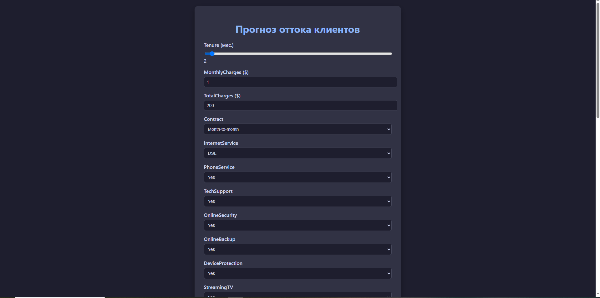
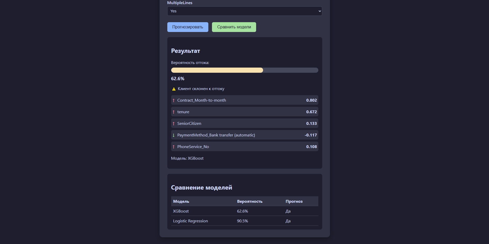
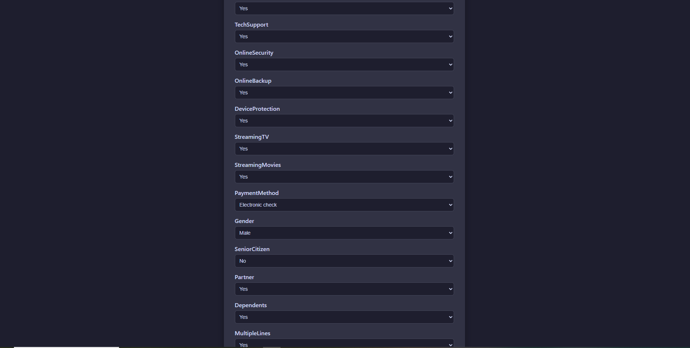

Set-Content -Path README.md -Value @"
# Прогноз оттока клиентов (Customer Churn Prediction API)

Веб-сервис для прогнозирования оттока клиентов на основе машинного обучения.
Позволяет рассчитать вероятность ухода клиента и объяснить, какие факторы на это влияют.

## Возможности

- Прогноз вероятности оттока для одного клиента (POST /predict)
- Пакетный прогноз для нескольких клиентов (POST /predict/batch)
- Сравнение трёх моделей: Logistic Regression, XGBoost, Neural Network
- SHAP-объяснения — показывает, какие факторы влияют на прогноз
- Веб-интерфейс для ввода данных и визуализации результатов
- Готов к запуску в Docker

## Технологии

- Python 3.11
- FastAPI
- XGBoost
- PyTorch (Neural Network)
- SHAP
- scikit-learn
- Docker

## Скриншоты





## Метрики моделей

| Модель | Accuracy | Precision | Recall | F1 | ROC-AUC |
|--------|----------|-----------|--------|-----|---------|
| Logistic Regression | 0.768 | 0.512 | 0.188 | 0.275 | 0.756 |
| XGBoost | **0.778** | **0.579** | 0.188 | 0.284 | 0.748 |
| Neural Network | 0.722 | 0.408 | **0.419** | **0.414** | 0.704 |

> Основная модель для прогнозов — **XGBoost** (лучшая точность).

## Быстрый старт

### Локально (без Docker)

```bash
python3.11 -m venv venv
# Windows: venv\Scripts\activate
# macOS/Linux: source venv/bin/activate
pip install -r requirements.txt
python train.py
uvicorn app.main:app --reload